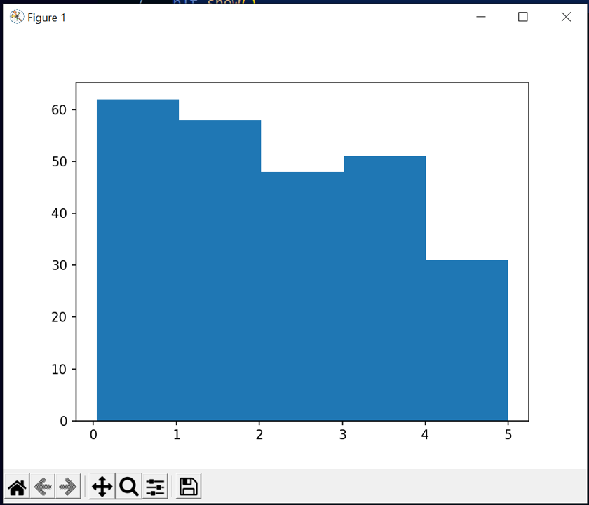
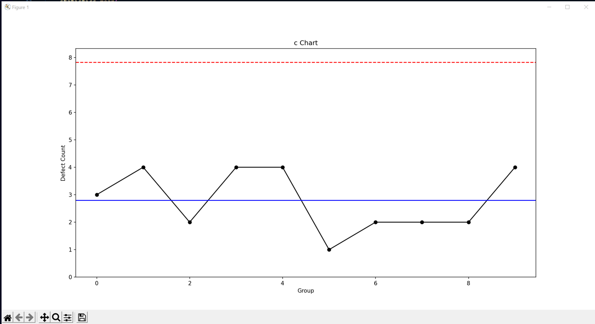
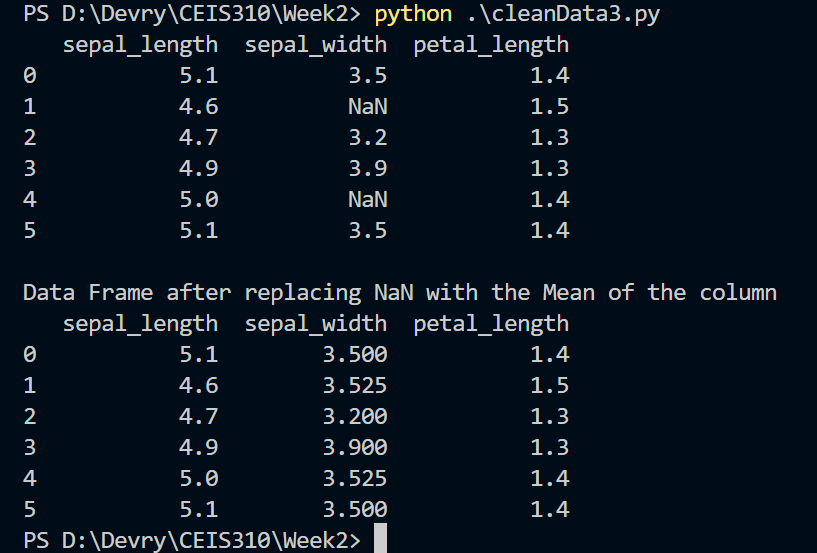
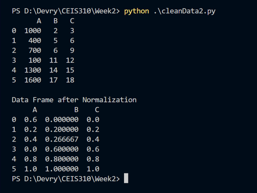
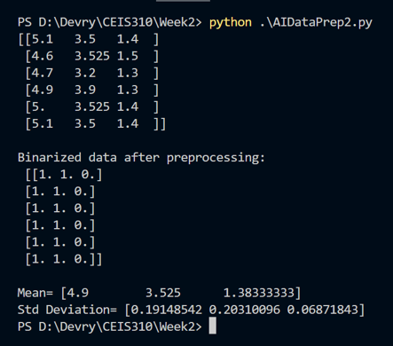

# CEIS310 - Process Improvement Project

## Introduction

The objective of this project is to bring awareness, instigate interest, and promote the need of using AI and machine learning algorithms and tools for process improvement.

In this module, we discovered how to use basic statistics and begin preparing our data for machin learning in Python using Numpy and SciPy. Both NumPy and SciPy are Python
libraries used for mathematical and numerical analysis. NumPy contains array data and basic operations such as sorting, indexing, and so forth, whereas SciPy consists of 
all the numerical code. SciPy has a number of subpackages for various scientific computations.

## Module 1: Uniform Data Distribution



```
Histogram with 5 bars
1st bar : how many array values b/w 0 and 1 ...
50 values between 0 and 1
46 values between 1 and 2
53 values between 2 and 3
52 values between 3 and 4
48 values between 4 and 5

```



```
C Chart with Random Values highlighting how 
a combination of NumPy and the statistics
module can be used to visualize a given dataset
```
<hr/>

## Module 2:Project Planning and Data Cleansing

In machine learning, one of the first tasks that you need to perform is data cleansing of the available data sets. It requires examining the data carefully for any missing values,
replacing with some valid values, and normalizing the data, just to name a few. 

Scikit-learn is a Python library that implements the various types of machine learning algorithms, such as classification, regression, clustering, decision tree, and more. Pandas,
or Panel Data Analysis, is a Python package providing fast, flexible, and expressive data structures designed to make working with "relational" or "labeled" data both easy and 
intuitive.

<hr/>

### When Pandas loads a data set, it uses NaN to represent an empty field. One of the ways to handle this issue is to replace all NaNs in that specific column with the average value
of that column.



### The objective of normalization is to change the values of the numeric columns in the dataset to use a common scale without modifying the differences in the range of values. We ne need to normalize the data in order to avoid a large disparity in the scale of numbers. This could cause problems when using the data set to train the model.



### Binarization will help us make our data binary. Using the Binarizer method, we convert based on the values to 0 or 1 depending on the threshold. Values greater than the threshold are mapped to 1, while those less than or equal are mapped to 0.


